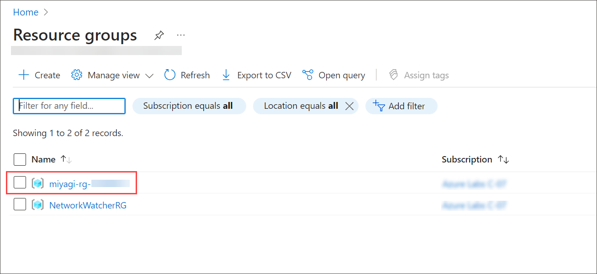
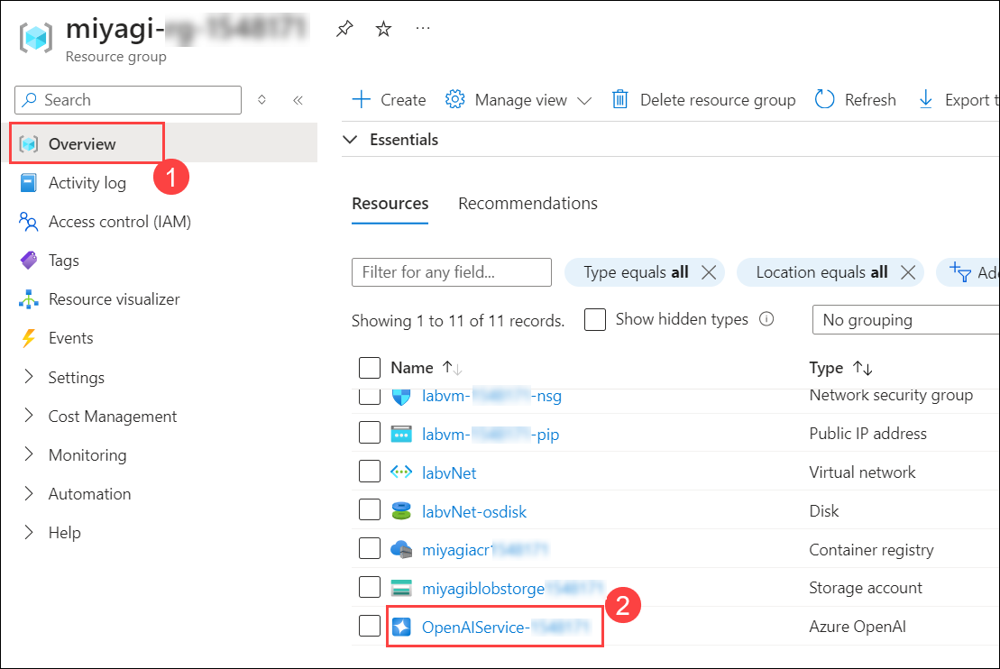
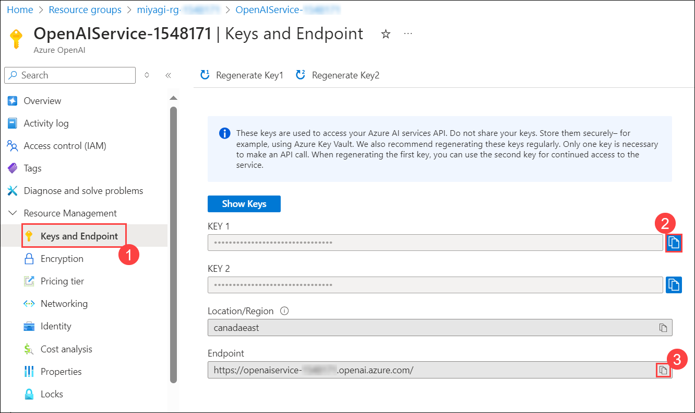

#  Verify and Review the values of Azure Resources 

### Estimated Duration: 20 minutes

In this Lab, verification and retrieval of specific values, including End Point, Connection String, and Key for the designated resources.

   - Azure OpenAI : **OpenAIService-<inject key="DeploymentID" enableCopy="false"/>** 
   - Azure Cosmos DB account : **cosmos-<inject key="DeploymentID" enableCopy="false"/>**
   - Search Service : **acs-<inject key="DeploymentID" enableCopy="false"/>**

1. To verify the deployment model names for "**deploymentOrModelId**" and "**embeddingDeploymentOrModelId**" follow the below steps:
   
      - In the Azure Portal, click on **Resource groups** from the Navigate panel.

      - From the Resource groups page, click on **miyagi-rg-<inject key="DeploymentID" enableCopy="false"/>**.

         

      - In the **miyagi-rg-<inject key="DeploymentID" enableCopy="false"/>**, from the **Overview (1)** tab select the **OpenAIService-<inject key="DeploymentID" enableCopy="false"/> (2)**.

        

      - In the **Overview** **(1)** page, click on **Go to Foundry portal** (2).

          
   
      - In the **Microsoft Foundry**, select **Deployments (1)**, under the Shared Resources section.

      - In the **Deployments** blade of Azure AI Studio, click on **gpt-4.1** model name **(2)** and verify the **deployment name** of gpt-4.1 model **(3)**.

          
        
          
      
      -  Navigate back to the **Deployment (1)** page

      - In the Deployments blade of Microsoft Foundry, click on **text-embedding-ada-002 model name (2)** and verify the **deployment name** of **text-embedding-ada-002 model (3)**.
        
         

         

1. To verify the values for **endpoint** and **apiKey** follow the below steps:

   -  Navigate back to the tab displaying **Azure portal**. 

   -  In the **OpenAIService-<inject key="DeploymentID" enableCopy="false"/>** blade under **Resource Management** section, select **Keys and Endpoint (1)**, verify the **KEY1 (1)** and **Endpoint (2)** 
     
      

1. To verify the values for  "azureCognitiveSearchEndpoint" and "azureCognitiveSearchApiKey", follow the steps below:
   
   - Navigate back to **miyagi-rg-<inject key="DeploymentID" enableCopy="false"/>** resource group.

   - On the **miyagi-rg-<inject key="DeploymentID" enableCopy="false"/>** page, select **acs-<inject key="DeploymentID" enableCopy="false"/>** from resources list.

      
 
   - On **acs-<inject key="DeploymentID" enableCopy="false"/>** blade, verify the **URL**.
   
      

   - On **acs-<inject key="DeploymentID" enableCopy="false"/>** blade, under **Settings** section, verify the **Primary admin Key** value.
   
      

1. To verify the values for "**cosmosDbUri**" and "**cosmosDbName**," please follow the steps below:

   - Navigative back to resource group **miyagi-rg-<inject key="DeploymentID" enableCopy="false"/>** resource group page, select **cosmos-<inject key="DeploymentID" enableCopy="false"/>** from resources list.

     

   - On **cosmos-<inject key="DeploymentID" enableCopy="false"/>** verify the **URL**.
     
     

   - On **cosmos-<inject key="DeploymentID" enableCopy="false"/>** under **Settings**, select **Keys** and verify the value of the **Cosmos DB Primary Connection String**.

     

1. To obtain the values for  "**blobServiceUri**", please follow the steps below:

   - Navigative back to resource group **miyagi-rg-<inject key="DeploymentID" enableCopy="false"/>** resource group page, select **miyagiblobstorge<inject key="DeploymentID" enableCopy="false"/>** from resources list.

     

   - In the **miyagiblobstorge<inject key="DeploymentID" enableCopy="false"/>** storage account from the left menu select **Endpoints** **(1)** under Settings verify the **Blob service** **(2)** under Blob service.

     

## Summary
In this lab, you will verify and retrieve configuration values such as Endpoint, Connection String, and Key for various Azure resources like OpenAI Service, Cosmos DB, and Cognitive Search. This ensures proper configuration and connectivity. The steps involve accessing the Azure Portal, navigating to specific resource groups, and verifying the required values.

### You have successfully completed this lab.
