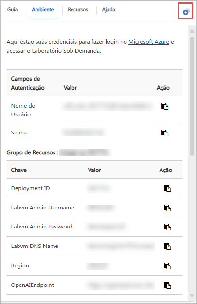
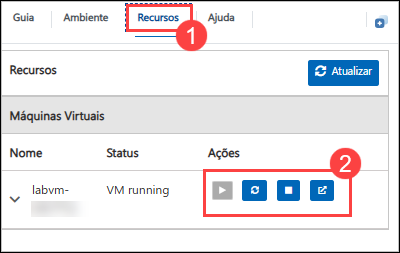
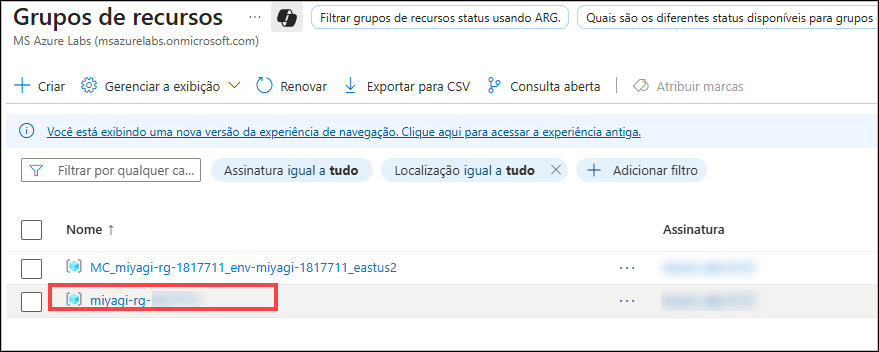

## Acessando seu ambiente de laboratório

Após a configuração do ambiente, o seu browser irá carregar uma máquina virtual (JumpVM), utilize esta máquina virtual durante todo o workshop para realizar o laboratório. Pode ver o número na parte inferior do guia de laboratório para alternar para diferentes exercícios no guia de.

   

## Explorando os recursos do seu laboratório

Para entender melhor os recursos e credenciais do seu laboratório, navegue até a aba **Ambiente**.

   

 > Verá o valor SUFFIX no separador **Ambiente**; utilize-o sempre que aparecer SUFFIX ou DeploymentID nas etapas do laboratório.

## Utilizando o recurso de janela dividida

Para sua conveniência, você pode abrir o guia de laboratório em uma janela separada selecionando o botão Dividir janela no canto superior direito.

   

## Gerenciando sua máquina virtual

Sinta-se à vontade para iniciar, parar ou reiniciar sua máquina virtual conforme necessário na aba Recursos. Sua experiência está em suas mãos!

   

## Guia de laboratório Ampliar/Reduzir

Para ajustar o nível de zoom da página do ambiente, clique no ícone **A↕ : 100%** localizado ao lado do cronômetro no ambiente de laboratório.

   

## Faça login no Portal Azure

1. Minimize o **Docker Desktop** clicando no botão **Minimizar**.

   

   - Se se deparar com algum problema, uma distribuição WSL do qual o Docker Desktop depende foi encerrada inesperadamente. Isto acontece normalmente como resultado de uma entidade externa terminar o WSL, clique no botão **Reiniciar**.

     

1. No JumpVM, clique no atalho do portal Azure do navegador Microsoft Edge, que é criado no ambiente de trabalho.

   

1. No separador **Entrar no Microsoft Azure**, verá o ecrã de login. Introduza o seguinte e-mail ou nome de utilizador e clique em **Seguinte**.

     * **E-mail/Nome de utilizador**: **<inject key="AzureAdUserEmail"></inject>**

       

1. Agora digite a seguinte palavra-passe e clique em **Entrar**.

    * **Palavra-passe**: **<inject key="AzureAdUserPassword"></inject>**

      

1. Se vir o pop-up **Permanecer ligado?**, selecione **Não**.

   

1. Se for apresentada uma janela pop-up **Bem-vindo ao Microsoft Azure**, selecione **Cancelar** para ignorar o tour.

   

1. Agora que verá o Painel do Portal Azure, clique em **Grupos de recursos** no painel Navegar para ver os grupos de recursos.

   

1. Em **Grupos de recursos**, clique em **miyagi-rg-<inject key="DeploymentID" enableCopy="false"/>** grupo de recursos.

   

1. No grupo de recursos **miyagi-rg-<inject key="DeploymentID" enableCopy="false"/>**, verifique os recursos nele presentes.

   

> [!IMPORTANTE] 
> **Para uma experiência mais tranquila durante o laboratório prático, é importante rever minuciosamente as instruções e as notas que as acompanham. Ajudará a navegar pelas tarefas com facilidade e confiança.**
