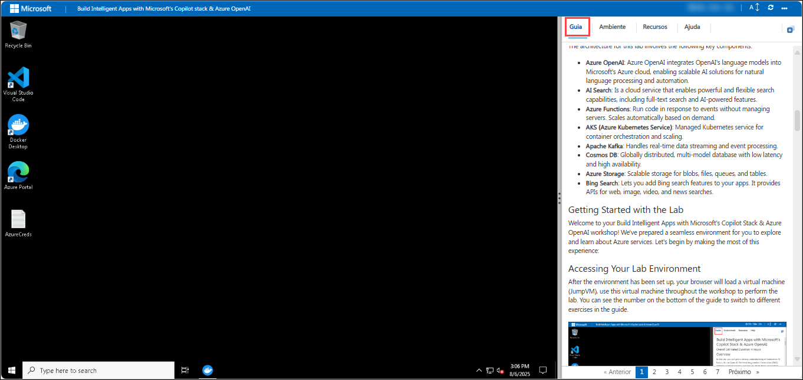
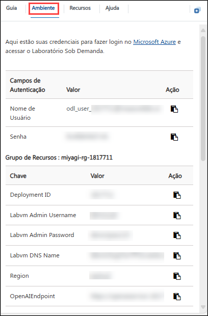
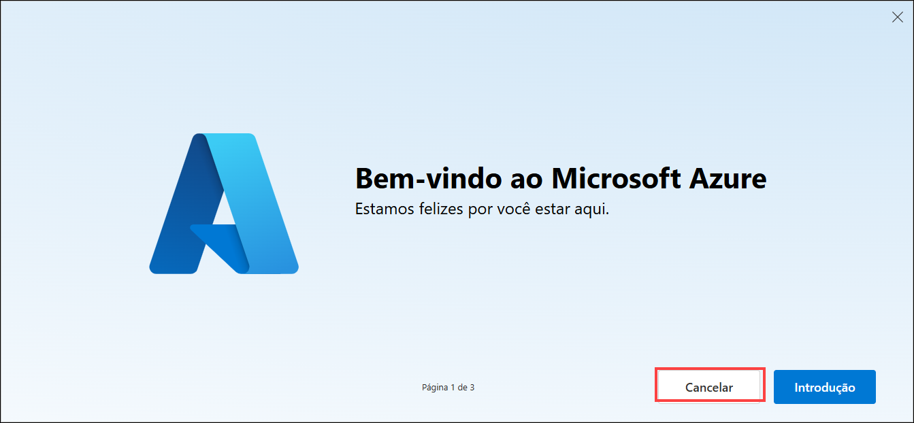
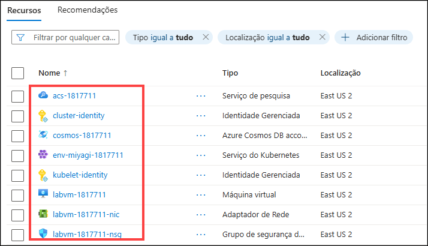

## Introduction to Miyagi 

### Duração: 10 minutos

O Miyagi foi criado para apresentar o Copilot Stack da Microsoft para a criação e implantação de aplicativos inteligentes avançados de nível empresarial. Esta iniciativa oferece uma exploração abrangente de casos de uso de aprendizado de máquina generativo e tradicional, oferecendo uma abordagem prática para o desenvolvimento de experiências de produtos aprimoradas por IA. Este workshop é voltado para engenheiros de software interessados em se aprofundar em padrões e técnicas de design emergentes que podem aprimorar seus aplicativos por meio da hiperpersonalização e do aprimoramento da produtividade.

## Objetivo
Neste workshop prático, você aprenderá como aproveitar o Copilot Stack da Microsoft para projetar e criar aplicativos de nível empresarial com tecnologia de IA que aumentam a produtividade e proporcionam experiências de usuário altamente personalizadas.

- **Interaja com ferramentas e metodologias:** aprenda técnicas de engenharia rápida (por exemplo, cadeia de pensamento, recuperação e aumento), vetorização para memória de longo prazo e ajuste fino de modelos de código aberto.

- **Apresentar Conceitos Avançados:** Explorar orquestração e plugins semelhantes a agentes para aprimorar modelos de linguagem de grande porte (LLMs).

- **Construir uma Base para Integração de IA:** Fornecer uma base sólida para integrar IA em aplicativos modernos.

## Principais habilidades e ferramentas

- **IA Generativa:** Compreendendo os fundamentos e as aplicações.

- **Azure OpenAI:** Implementando soluções de IA usando os serviços OpenAI do Azure.

- **Padrões de Geração Aumentada de Recuperação (RAG):** Aprimorando modelos de IA com RAG.

- **Núcleo Semântico:** Utilizando o Núcleo Semântico para tarefas orientadas por IA.

- **Copilot Stack da Microsoft:** Aproveitando o Copilot Stack da Microsoft para construir sistemas inteligentes.

- **Casos de Uso Prático:** Aplicando conhecimento a cenários do mundo real para visualizar e criar soluções inteligentes.

## Para quem é isso

Este workshop foi concebido para:

- Desenvolvedores e arquitetos com conhecimentos básicos de desenvolvimento de aplicativos que desejam incorporar IA em seus aplicativos.

- Gerentes de produto e designers interessados em utilizar IA para aprimorar a experiência do usuário.

- Qualquer pessoa curiosa sobre o potencial da IA no desenvolvimento de aplicativos.

## Acessando seu ambiente de laboratório

#### Duração: 10 minutos

Após a configuração do ambiente, o seu browser irá carregar uma máquina virtual (JumpVM), utilize esta máquina virtual durante todo o workshop para realizar o laboratório. Pode ver o número na parte inferior do guia de laboratório para alternar para diferentes exercícios no guia de.

   

## Explorando os recursos do seu laboratório

Para entender melhor os recursos e credenciais do seu laboratório, navegue até a aba **Ambiente**.

   

 > Verá o valor SUFFIX no separador **Ambiente**; utilize-o sempre que aparecer SUFFIX ou DeploymentID nas etapas do laboratório.

## Utilizando o recurso de janela dividida

Para sua conveniência, você pode abrir o guia de laboratório em uma janela separada selecionando o botão Dividir janela no canto superior direito.

   

## Gerenciando sua máquina virtual

Sinta-se à vontade para iniciar, parar ou reiniciar sua máquina virtual conforme necessário na aba Recursos. Sua experiência está em suas mãos!

   

## Guia de laboratório Ampliar/Reduzir

Para ajustar o nível de zoom da página do ambiente, clique no ícone **A↕ : 100%** localizado ao lado do cronômetro no ambiente de laboratório.

   

## Faça login no Portal Azure

1. Minimize o **Docker Desktop** clicando no botão **Minimizar**.

   

   - Se se deparar com algum problema, uma distribuição WSL do qual o Docker Desktop depende foi encerrada inesperadamente. Isto acontece normalmente como resultado de uma entidade externa terminar o WSL, clique no botão **Reiniciar**.

     

1. No JumpVM, clique no atalho do portal Azure do navegador Microsoft Edge, que é criado no ambiente de trabalho.

   

1. No separador **Entrar no Microsoft Azure**, verá o ecrã de login. Introduza o seguinte e-mail ou nome de utilizador e clique em **Seguinte**.

     * **E-mail/Nome de utilizador**: **<inject key="AzureAdUserEmail"></inject>**

       

1. Agora digite a seguinte palavra-passe e clique em **Entrar**.

    * **Palavra-passe**: **<inject key="AzureAdUserPassword"></inject>**

      

1. Se vir o pop-up **Permanecer ligado?**, selecione **Não**.

   

1. Se for apresentada uma janela pop-up **Bem-vindo ao Microsoft Azure**, selecione **Cancelar** para ignorar o tour.

   

1. Agora que verá o Painel do Portal Azure, clique em **Grupos de recursos** no painel Navegar para ver os grupos de recursos.

   

1. Em **Grupos de recursos**, clique em **miyagi-rg-<inject key="DeploymentID" enableCopy="false"/>** grupo de recursos.

   

1. No grupo de recursos **miyagi-rg-<inject key="DeploymentID" enableCopy="false"/>**, verifique os recursos nele presentes.

   

> **[MPORTANTE]**  
> **Para uma experiência mais tranquila durante o laboratório prático, é importante rever minuciosamente as instruções e as notas que as acompanham. Ajudará a navegar pelas tarefas com facilidade e confiança.**

Agora, clique em Avançar no canto inferior direito para avançar para a **próxima** página.

