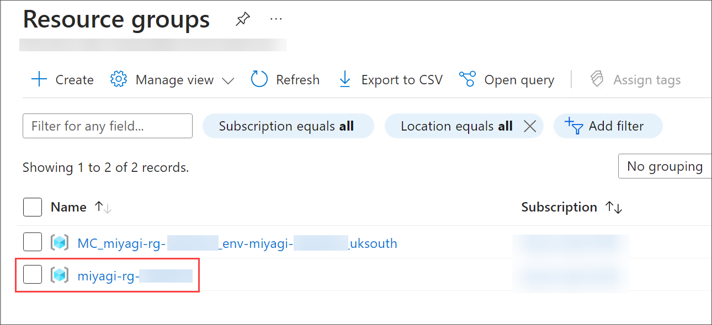

# Laboratório 1: Verificação e Recuperação dos Valores dos Recursos do Azure (opcional)

### Duração Estimada: 20 minutos
Neste laboratório, você verificará e recuperará valores específicos, como Endpoint, Connection String e Key, para vários recursos do Azure. Esta etapa é fundamental para garantir a configuração e conectividade adequadas destes recursos.

 - Azure OpenAI: **OpenAIService-<inject key="DeploymentID" enableCopy="false"/>**
 - Conta do Azure Cosmos DB: **cosmos-<inject key="DeploymentID" enableCopy="false"/>**
 - Serviço de pesquisa: **acs-<inject key="DeploymentID" enableCopy="false"/>**

1. Para verificar os nomes dos modelos de implementação para "**deploymentOrModelId**" e "**embeddingDeploymentOrModelId**" siga os passos abaixo:

    - Na página inicial do Portal do Azure, clique em **Grupos de recursos** no painel **Navegação**.

      

    - Na página Grupos de recursos, clique em **miyagi-rg-<inject key="DeploymentID" enableCopy="false"/>**.

      

    - No **miyagi-rg-<inject key="DeploymentID" enableCopy="false"/>**, na guia Visão Geral, selecione o **OpenAIService-<inject key="DeploymentID" enableCopy="false"/>** .

      

    - Na página **Visão Geral do OpenAI**, clique com o botão direito em **Ir para o Azure OpenAI Studio** e escolha **Abrir link em uma nova guia**.

      

    - No **Azure AI Studio**, no painel de navegação esquerdo, na seção **Gerenciamento**, selecione **Implantações**.

      

    - Na guia **Implantações** do Azure AI Studio, clique no nome do modelo **gpt-4** **(1)** e verifique o **nome da implantação** do modelo gpt-4 **(2)**.

      .png)

      .png)

    - Navegue de volta para a página **Implantação**.

    - Na guia **Implantações** do Azure AI Studio, clique em **nome do modelo text-embedding-ada-002 (1)** e verifique o **nome da implementação** do modelo **text-embedding-ada-002 (2)**.

      .png)

      .png)

1. Para verificar os valores de **endpoint** e **apiKey** siga os passos abaixo:

    - Navegue de volta para a guia que exibe **portal do Azure**.

    - Na painel **OpenAIService-<inject key="DeploymentID" enableCopy="false"/>** sob a seção **Gerenciamento de Recursos**, selecione **Chaves e Ponto de Extremidade (1)**, verifique a **CHAVE 1 (2)** e **Ponto de Extremidade (3)**.

      

1. Para verificar os valores de "azureCognitiveSearchEndpoint" e "azureCognitiveSearchApiKey", siga os passos abaixo:

    - Navegue de volta ao grupo de recursos **miyagi-rg-<inject key="DeploymentID" enableCopy="false"/>**.

    - Na página **miyagi-rg-<inject key="DeploymentID" enableCopy="false"/>**, selecione **acs-<inject key="DeploymentID" enableCopy="false"/>** na lista de recursos.

      

    - Na guia **acs-<inject key="DeploymentID" enableCopy="false"/>**, verifique o **URL**.

      

    - Na guia **acs-<inject key="DeploymentID" enableCopy="false"/>**, na seção **Configurações**, selecione **Chaves (1)** e verifique o valor da **Chave de administração primária (2)**.

      

1. Para verificar os valores de "**cosmosDbUri**" e "**cosmosDbName**", siga os passos abaixo:

    - Navegue de volta à página do grupo de recursos **miyagi-rg-<inject key="DeploymentID" enableCopy="false"/>**, selecione **cosmos-<inject key="DeploymentID" enableCopy= "false"/>** na lista de recursos.

      

    - Em **cosmos-<inject key="DeploymentID" enableCopy="false"/>**, verifique o **URL**.

      

    - Em **cosmos-<inject key="DeploymentID" enableCopy="false"/>** em **Configurações**, seleccione **Chaves** e verifique o valor da **Cadeia de conexão primária** .

      

1. Para obter os valores de **blobServiceUri**, siga os passos abaixo:

    - Navegue de volta à página do grupo de recursos **miyagi-rg-<inject key="DeploymentID" enableCopy="false"/>**, selecione **miyagiblobstorge<inject key="DeploymentID" enableCopy=" false"/>** na lista de recursos.

      

    - Na conta de armazenamento **miyagiblobstorge<inject key="DeploymentID" enableCopy="false"/>** no menu esquerdo, selecione **Ponto de Extremidade** **(1)** na seção **Configurações**, verifique o **Serviço Blob** **(2)** no serviço Blob.

      

## Resumo
Neste laboratório, você irá verificar e recuperar valores de configuração como Endpoint, Connection String e Key para vários recursos do Azure, como OpenAI Service, Cosmos DB e Cognitive Search. Essa etapa é crucial para garantir que seus serviços estejam comunicando-se corretamente e funcionando como esperado. Você navegará pelo Portal do Azure para encontrar esses detalhes.

### Você concluiu com sucesso este laboratório. Agora, clique em **Avançar** no canto inferior direito para passar para a próxima página.
