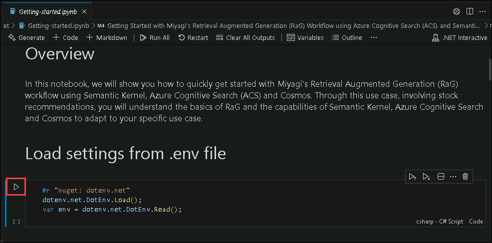
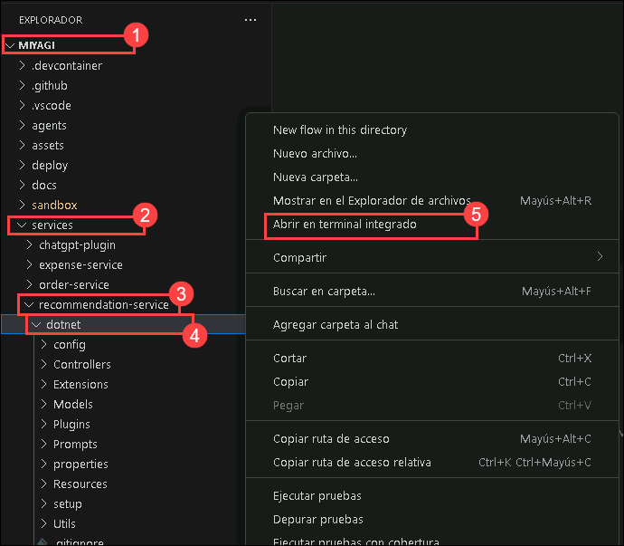

# Laboratório 2 - Execute a aplicação Miyagi localmente

### Duração: 90 minutos

Neste laboratório, o objetivo é configurar a aplicação Miyagi para operação. Em seguida, será dada atenção à implementação detalhada do serviço de recomendação. A fase prática envolverá a execução do serviço de recomendação e a implementação local do frontend Miyagi para testes e desenvolvimento. Uma etapa crucial inclui a otimização da eficiência da recuperação de dados, persistindo incorporações no Azure AI Search. O projeto culminará em uma exploração mais ampla da aplicação Miyagi e do serviço de recomendação, enfatizando uma experiência personalizada para o usuário. Esta abordagem baseada em tarefas assegura uma progressão sistemática através das complexidades do projeto, facilitando uma compreensão abrangente e uma implementação eficaz.

### Tarefa 1: Configuração da aplicação miyagi

Nesta tarefa, você configurará a aplicação Miyagi, preparando o ambiente de desenvolvimento, instalando as dependências necessárias e configurando o banco de dados.

1. Abra o **Visual Studio Code** na área de trabalho da Lab VM, clicando duas vezes sobre o mesmo.

   

   >**Observação:** Se a Janela **Junte-se a nós para melhorar a extensão prompt-flow!** for exibida, clique em **Não, obrigado**.

   

1. No **Visual Studio Code**, na barra de menu, selecione **Arquivo (1) > Abrir pasta (2)**.

   

1. No **Explorador de Arquivos**, navegue até **C:\LabFiles\miyagi** selecione **miyagi** **(1)** e clique em **Selecionar pasta (2)**

   .png)

1. No **Visual Studio Code**, clique em **Sim, confio nos autores dos arquivos nesta pasta** quando a janela **Você confia nos autores dos arquivos nesta pasta?** for exibida.

   

1. Expanda o diretório **miyagi>ui** e verifique se o arquivo **. env.** está presente.

1. Expanda o diretório **miyagi/services/recommendation-service/dotnet** e verifique se o arquivo **appsettings. json** está presente.

   

1. Abra o arquivo **appsettings. json** e substitua os seguintes valores para as variáveis ​​abaixo.

   | **Variáveis**                | **Valores**                                                   |
   | ---------------------------- |---------------------------------------------------------------|
   | deploymentOrModelId          | **<inject key="CompletionModel" enableCopy="true"/>**         |
   | embeddingDeploymentOrModelId | **<inject key="EmbeddingModel" enableCopy="true"/>**          |
   | endpoint                     | **<inject key="OpenAIEndpoint" enableCopy="true"/>**          |
   | apiKey                       | **<inject key="OpenAIKey" enableCopy="true"/>**               |
   | azureCognitiveSearchEndpoint | **<inject key="SearchServiceuri" enableCopy="true"/>**        |
   | azureCognitiveSearchApiKey   | **<inject key="SearchAPIkey" enableCopy="true"/>**            |
   | cosmosDbUri                  | **<inject key="CosmosDBuri" enableCopy="true"/>**             |
   | blobServiceUri               | **<inject key="StorageAccounturi" enableCopy="true"/>**       |
   | bingApiKey                   | **<inject key="Bing_API_KEY" enableCopy="true"/>**           |
   | cosmosDbConnectionString     | **<inject key="CosmosDBconnectinString" enableCopy="true"/>** |
   

    > **Observação**: Para sua informação, os valores/Chaves/Endpoints/ConnectionString dos recursos do Azure acima são injetados diretamente no guia do laboratório. Deixe as configurações padrão para "cosmosDbContainerName": "recommendations" e "logLevel": "Trace".

   1.png)

1. Após atualizar os valores, salve o arquivo pressionando **CTRL + S**.

1. Navegue para **miyagi/sandbox/usecases/rag/dotnet** e verifique se o arquivo **. env** está presente.

1. No arquivo **. env**, substitua os seguintes valores pelas variáveis ​​abaixo.

   | **Variáveis**                          | **Valores**                                           |
   | ---------------------------------------| ------------------------------------------------------|
   | AZURE_OPENAI_ENDPOINT                  | **<inject key="OpenAIEndpoint" enableCopy="true"/>**  |
   | AZURE_OPENAI_CHAT_MODEL                | **<inject key="CompletionModel" enableCopy="true"/>** |
   | AZURE_OPENAI_EMBEDDING_MODEL           | **<inject key="EmbeddingModel" enableCopy="true"/>**  |
   | AZURE_OPENAI_API_KEY                   | **<inject key="OpenAIKey" enableCopy="true"/>**       |
   | AZURE_COGNITIVE_SEARCH_ENDPOINT        | **<inject key="SearchServiceuri" enableCopy="true"/>**|
   |AZURE_COGNITIVE_SEARCH_API_KEY          | **<inject key="SearchAPIkey" enableCopy="true"/>**    |
   

   .png)

1. Após atualizar os valores, salve o arquivo pressionando **CTRL + S**.

    >**Parabéns** pela conclusão da tarefa! Agora é hora de validar o que você fez. Aqui estão os passos:
    > - Clique no botão Validar para a tarefa correspondente. Se aparecer uma mensagem de sucesso, a validação do laboratório foi realizada com êxito!
    > - Caso contrário, leia atentamente a mensagem de erro e tente novamente a etapa, seguindo as instruções do guia do laboratório.
    > - Se precisar de ajuda, contacte-nos através do e-mail labs-support@spektrasystems.com.

 <validation step="d37dd2bb-631a-4ffe-a41e-fc3ef07aa2b5" />

### Tarefa 2: Compreendendo a implementação do serviço de recomendação

Nesta tarefa, você explorará a implementação do serviço de recomendação, concentrando-se em seus algoritmos e métodos de processamento de dados para fornecer sugestões personalizadas.

O serviço de recomendação implementa o padrão RAG utilizando o SDK do Kernel Semântico. Os detalhes da implementação são capturados no Jupyter notebook na pasta miyagi/sandbox/usecases/rag/dotnet. Você pode abrir o notebook no VSCode e executar as células para entender passo a passo como o serviço de recomendação é implementado. Preste atenção especial a como o padrão RAG é implementado usando o Kernel Semântico. Selecione o kernel como .NET Interactive no canto superior direito do notebook.

1. No Visual Studio Code, navegue até à pasta **miyagi/sandbox/usecases/rag/dotnet** e selecione **Getting-started.ipynb**

   

1. **Execute o notebook célula por célula** (utilizando Ctrl + Enter para permanecer na mesma célula ou Shift + Enter para avançar para a próxima célula) e observe os resultados da execução de cada célula.

    > **Observação**: Certifique-se de que o **. Net Interactive** está no estado pronto. Se não estiver, aguarde de 15 a 20 segundos. Além disso, evite clicar na opção **Executar tudo** para executar todas as células de uma vez, pois isso pode resultar em um limite de token excedido, causando o erro: 503 – Serviço inacessível.

   

    > **Observação**: Em caso de quaisquer problemas ou erros relacionados ao limite de taxa de chamada excedido do seu nível de preços atual do OpenAI S0, aguarde de 15 a 20 segundos e execute novamente a célula.

    >**Parabéns** pela conclusão da tarefa! Agora é hora de validar o que você fez. Aqui estão os passos:
    > - Clique no botão Validar para a tarefa correspondente. Se aparecer uma mensagem de sucesso, você validou com sucesso o laboratório.
    > - Caso contrário, leia atentamente a mensagem de erro e tente novamente o passo, seguindo as instruções do guia do laboratório.
    > - Se precisar de ajuda, contacte-nos através do e-mail labs-support@spektrasystems.com.

<validation step="f277b99e-c179-4bb8-b9c1-6479a526ee4b" />

### Tarefa 3: Executar o serviço de recomendação localmente

Nesta tarefa, você configurará o ambiente, instalará as dependências necessárias e executará o serviço de recomendação localmente para testar e desenvolver recursos de forma eficaz.

1. Abra um novo terminal: navegando até **miyagi/services/recommendation-service/dotnet** e clicando com o botão direito do mouse em **dotnet** e selecione **Abrir em terminal de intergado**.

   

1. Execute o seguinte comando para executar o serviço de recomendação localmente:

    ```
    dotnet build
    dotnet run
    ```

    > **Nota**: Deixe o comando ser executado, enquanto você prossegue com a próxima etapa.
    > **Nota** Os comandos dotnet build e dotnet run são fundamentais em ambientes .NET Core e .NET 5+ para criar e executar aplicações .NET localmente na sua máquina.

1. Abra uma nova guia no Edge, na janela do navegador, cole o seguinte link:

    ```
    http://localhost:5224/swagger/index.html
    ```

    > **Nota**: Atualize a página continuamente até obter a página Swagger para o serviço de recomendação, conforme mostrado na imagem abaixo.

   


### Tarefa 4: Executar o frontend Miyagi localmente

Nesta tarefa, será realizada a execução local do frontend Miyagi. A instalação das dependências será feita por meio dos gerenciadores de pacotes npm e yarn. Em seguida, o servidor de desenvolvimento será iniciado para permitir a verificação da funcionalidade do aplicativo, acessando-o através do navegador.

1. Abra um novo terminal: navegando até **miyagi/ui** e clicando com o botão direito do mouse em **ui/typescript**, no menu em cascata, selecione **Abrir em terminal integrado**.

   

1. Execute o seguinte comando para instalar as dependências:

    ```
    npm install --global yarn
    yarn install
    yarn dev
    ```

    > **Nota**: Aguarde a conclusão da instalação das dependências. Esse processo pode levar até 5 minutos. Após o comando **yarn dev** iniciar, aguarde mais 2 minutos antes de continuar.

    > **Nota**: Comandos (npm install --global Yarn, Yarn Install e Yarn Dev) são realmente essenciais em projetos JavaScript e TypeScript para gerir dependências e executar scripts necessários para configurar e executar aplicações. Garantem que todos os pacotes necessários sejam instalados (yarn install) e executem scripts de desenvolvimento (yarn dev) definidos na configuração do projeto (package.json).

1. Abra uma nova guia no Edge e navegue para o seguinte endereço:

    ```
    http://localhost:4001
    ```
   > **Nota**: Atualize a página continuamente até que o aplicativo Miyagi seja executado localmente, conforme mostrado na imagem abaixo.

### Tarefa 5: Persistindo incorporações no Azure AI Search

Nesta tarefa, você irá persistir as incorporações no serviço Azure AI Search executando um pedido POST na interface do usuário do Swagger, verificando a execução e, em seguida, confirmando a criação do índice no portal do Azure.

1. Navegue de volta para a página da interface **Swagger**, vá até à seção **Memory**, clique em **POST /dataset (1)** para expandir e, em seguida, clique em **Experimentar(2)**.

   

1. Substitua o **código (1)** abaixo pelo código abaixo e clique em **Executar (2)**.

     ```
     {
        "metadata": {
              "userId": "50",
              "riskLevel": "aggressive",
              "favoriteSubReddit": "finance",
              "favoriteAdvisor": "Jim Cramer"
            },
          "dataSetName": "intelligent-investor"
      }
      ```

   .png)

1. Na página da interface **Swagger**, vá até a seção **Responses**, verifique se a execução foi bem-sucedida conferindo se o código de status é **200**.

   

1. Retorne à guia do **Portal do Azure**. Na parte superior da página, você encontrará uma barra de pesquisa. Nela, digite **AI Search** e pressione Enter. Em seguida, escolha a opção **AI Search** que aparecer nos resultados.

   

1. Em **serviços Azure IA | guia AI Search**, selecione **acs-<inject key="DeploymentID" enableCopy="false"/>**.

   

1. Na guia Serviço de pesquisa do **acs-<inject key="DeploymentID" enableCopy="false"/>**, clique em **Índices** **(1)** em Gerenciamento de Pesquisa e verifique se o **miyagi-embeddings** **(2)** foi criado.

   

    > **Nota**: Clique no botão de atualizar até que você veja a **Contagem de documentos**.

    >**Parabéns** pela conclusão da tarefa! Agora é hora de validar o que você fez. Aqui estão os passos:
    > - Clique no botão Validar para a tarefa correspondente. Se aparecer uma mensagem de sucesso, você validou com sucesso o laboratório.
    > - Caso contrário, leia atentamente a mensagem de erro e tente novamente o passo, seguindo as instruções do guia do laboratório.
    > - Se precisar de ajuda, contacte-nos através do e-mail labs-support@spektrasystems.com.

 <validation step="940ebf1a-9add-4bf0-a7fd-c6d929961497" />

### Tarefa 6: Explore a aplicação Miyagi e o serviço de recomendação personalizando-o

Nesta tarefa, você irá personalizar o serviço de recomendação da aplicação Miyagi, selecionando um consultor financeiro e analisando as recomendações. Em seguida, irá verificar os registos no Visual Studio Code e interromper os serviços.

1. Navegue de volta para a página da interface do utilizador do **serviço de recomendação** e clique no botão **personalizar**.

   

1. Na página **Personalizar**, selecione o seu **Consultor financeiro favorito (1)** e escolha **GPT-4 (2)** para o **Mecanismo de raciocínio** no menu suspenso e clique em em **Personalizar (3)**.

   

1. Deverá ver as recomendações do serviço de recomendação no widget Principais ações.

   

1. Navegue até **Visual Studio Code** e clique em **dotnet** no terminal, pode passar pelos logs.

   

1. Depois de visualizar os registos, prima **Ctrl + C** para interromper a página **Swagger UI**.

1. No terminal **Terminal**, selecione **Nó** e prima **Ctrl + C** para interromper a página da interface do utilizador do **serviço de recomendação**.
   

1. Agora, clique em **Seguinte** no canto inferior direito para passar para a página seguinte.

## Resumo

Neste laboratório, começou por configurar a aplicação Miyagi para prontidão operacional, seguida de uma exploração detalhada da implementação do serviço de recomendação. A execução prática envolve a execução do serviço de recomendação e a implementação local do frontend Miyagi para teste. Melhorar a eficiência da recuperação de dados é um passo fundamental, alcançado através de incorporações persistentes no Azure AI Search. O projeto termina com uma ampla exploração da App Miyagi e do serviço de recomendação, dando prioridade a uma experiência de utilizador personalizada. Esta abordagem sistemática garante uma compreensão completa e uma implementação eficaz ao longo de todo o projeto.

### Concluiu este laboratório com sucesso. Agora clique em Seguinte no canto inferior direito para passar para a página seguinte.
