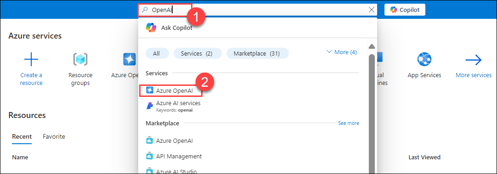
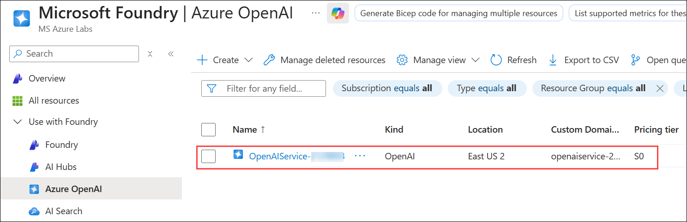
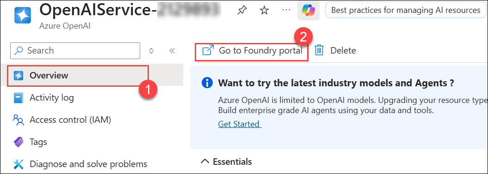

# Lab 1: Bringing your own data with Azure AI Search

## Lab objectives 

In this lab, you'll run Chat Copilot locally after retrieving Azure OpenAI Service values from the Azure portal. By cloning the Chat-Copilot GitHub repo and setting up dependencies, you'll configure and execute the application. Uploading documents enables interaction with Copilot, which generates responses based on their content, complete with citations for validation. This exercise provides hands-on experience in utilizing Chat Copilot with your own data, managing documents and sessions within the application.

# Exercise 1: Run the Chat Copilot App Locally

- Task 1: Retrieving the Azure OpenAI Service values
- Task 2: Cloning the Chat-Copilot GitHub Repo
- Task 3: Setting up the Environment
- Task 4: Configure and run the Chat Copilot App locally

# Exercise 2: Chat with your own documents

- Task 1: Chat with your own documents in the Chat Copilot Application
- Task 2: Cloning the Chat-Copilot GitHub Repo
 
# Exercise 1: Run the Chat Copilot App Locally

In this lab, you will run the Chat Copilot app locally by setting up the environment, installing dependencies, and launching the application for testing and interaction.

### Task 1: Retrieving the Azure OpenAI Service values

In this task, you will retrieve the Azure OpenAI Service values by accessing the service configuration, querying the API, and ensuring the correct integration of parameters for your application.

1. In the Azure Portal, search for **OpenAI (1)** and select **Azure OpenAI (2)**
   
    

1. On the **Microsoft Foundry | Azure OpenAI** page, select the **Azure OpenAI** resource that was created.

      

1. Select **Keys and Endpoints (1)** from the left pane under **Resource Management**. Copy **Key 1 (2)** and the **Endpoint (3)**, and store them in Notepad.
   
    

1. On **OpenAIService-<inject key="DeploymentID" enableCopy="false"/>**, from the **Overview (1)** page, click **Go to Foundry portal (2)**.
   
    

1. Go to **Deployments** in the left navigation pane under **Shared resources**. Click the names of your AI models to copy them, and paste them into Notepad.
    
    

    > **Note**: Click on the **Expand** button, if you don't see the left side navigation pane.         

### Task 2: Cloning the Chat-Copilot GitHub Repo

In this task, you will clone the Chat-Copilot GitHub repository by using Git commands to download the code to your local machine for further exploration and development.

1. On the **LabVM**, click **Start**, search for **PowerShell**, and open **PowerShell** as an administrator.

      
   
1. Navigate to the directory `C:/Users/azureuser` by running the command below.
 
   ``` 
   cd C:/Users/azureuser
   ```
1. Run the command to clone the GitHub repository.
   
   ``` 
   git clone https://github.com/CloudLabsAI-Azure/chat-copilot CHAT-COPILOT
   ```
1. Open Visual Studio Code from the LabVM Desktop and click on `File (1) > Open folder (2)`.

   

1. Select **CHAT-COPILOT (1)** and click **Select Folder (2)**.

   

1. Review the files.

   

   > **Note**: If the pop-up appears for **Do you trust the authors of the file in this folder?**, click on **Yes, I trust the authors.**   

### Task 3: Setting up the Environment

In this task, you will set up the environment for the Chat-Copilot project by installing necessary dependencies, configuring environment variables, and preparing the development environment for local execution.

1. Open **PowerShell** as an administrator on your local machine. Ensure that **PowerShell Core 6+** is installed, as it is different from the default PowerShell that comes with Windows.

   

1. Set up your environment by navigating to the scripts directory of chat-copilot using the command:

   ``` 
   cd C:\Users\azureuser\chat-copilot\scripts\
   ```

1. Run the below command to install Chocolatey, dotnet-7.0-sdk, nodejs, and yarn:

   ```
   .\Install.ps1
   ```

   >**Note:** If you receive an error that the script is not digitally signed or cannot execute on the system, you may need to change the execution policy or unblock the script.

### Task 4: Configure and run the Chat Copilot App locally

In this task, you will configure and run the Chat Copilot app locally by setting up the environment, adjusting configuration files, and launching the application for testing and development.

1. Run the following command to configure **Chat Copilot**.
   
   ```
   .\Configure.ps1 -AIService AzureOpenAI -APIKey <inject key="OpenAIKey" enableCopy="true"/> -Endpoint <inject key="OpenAIEndpoint" enableCopy="true"/> -CompletionModel <inject key="CompletionModel" enableCopy="true"/> -EmbeddingModel <inject key="EmbeddingModel" enableCopy="true"/>
   ```

   >**Note:** If a Security warning pop-up window appears, choose **Yes**
   >
   >**Note:** The code should look similar to the image below:

     

1. Run **Chat Copilot** locally. This step starts the **backend API** and **frontend** applications.
 
   ```powershell
   .\Start-Backend.ps1
   ```
   > **Note:** It may take a few minutes for Yarn packages to install on the first run.
 
1. Open another tab in **Edge**, in the browser window, paste the following link, and you should see a confirmation message:  `Healthy`.
 
   ```powershell
   http://localhost:40443/healthz
   ```
   > **Note:** Don't close the PowerShell window, keep it running up.
  
     
    
1. In the LabVM, click on **Start**, from the start menu search and select for **PowerShell 7**.

   
 
1. Run the following command to change the path.
 
   ```
   cd C:\Users\azureuser\chat-copilot\scripts\
   ```
 
1. Run the following to set the execution policy.
 
   ```
   Set-ExecutionPolicy -ExecutionPolicy Unrestricted -Scope Process
   ```
 
1. The execution policy helps protect you from running untrusted scripts. Changing the execution policy may expose you to security risks described in the **about_Execution_Policies** help topic. If prompted with **“Do you want to change the execution policy?”**, enter **A** and press **Enter**.
 
1. Configure **Chat Copilot** by running the following command.
 
   ```powershell
   .\Start-Frontend.ps1
   ```

1. Once the deployment of the script is executed successfully, it will redirect to `http://localhost:3000/` Chat Copilot in **Edge** browser.
 
   >**Note:** Please wait for 2-3 minutes for the browser to load
  
1. You will get an output similar to this for the frontend:

   

1. You will get an output similar to this for the backend:

   

>**Congratulations** on completing the Task! Now, it's time to validate it. Here are the steps:
> - Hit the Validate button for the corresponding task. If you receive a success message, you have successfully validated the lab. 
> - If not, carefully read the error message and retry the step, following the instructions in the lab guide.
> - If you need any assistance, please contact us at labs-support@spektrasystems.com.

<validation step="e9d5c65d-aefe-4e0d-96b1-d2dd82346507" />

# Exercise 2: Chat with your own documents

In this lab, you will chat with your own documents by uploading files to the Chat Copilot app and interacting with the integrated chat interface for personalized responses.

## Task 1: Chat with your own documents in the Chat Copilot Application

In this task, you will learn how to chat with your own documents in the Chat Copilot application by uploading files, configuring the document processing, and interacting with the integrated chat interface for personalized responses.

1. Click on the **Documents (1)** tab at the top and click on **Upload (2)** and select **+ New local chat document (3).**

      

1. Navigate to `C:\Labfiles\Documents` to upload the 3 PDFs. Select the 3 files and click **Open.**

    

1. Once it is uploaded, Naviagte to the **Chat (1)** tab then provide the below prompt **(2)** then click **send (3)** button and then check how the response is generated by Copilot.

    ```
    How to operate Android Auto in Porche Taycan? Give step-by-step instructions.
    ```
    
   
1. Provide another prompt and check how the response is generated by Copilot.

    ```
    Give detailed information on Apple CarPlay.
    ```
    

    >**Note:** If you receive an error stating **“token limit exceeded,”** wait for a few minutes and try again.
   
1. The response not only answers the question based on the content found in the documents, but also includes citations **(1)** to validate the accuracy of the information. When you click on a citation, the app navigates directly to the relevant page of the document **(2)** that compares the plans, allowing you to read more or further verify the accuracy of the answer under the **Citation** section.

1. Click the **Edit** button on the left to rename the item.

## Summary

In this lab, you have accomplished the following:

- Retrieved Azure OpenAI Service values for proper integration.  
- Cloned the Chat-Copilot GitHub repository to access the code.  
- Set up the environment with required dependencies and configurations.  
- Ran the Chat Copilot app locally for testing purposes.  
- Interacted with your documents within the Chat Copilot app.  

### You have successfully completed the lab
