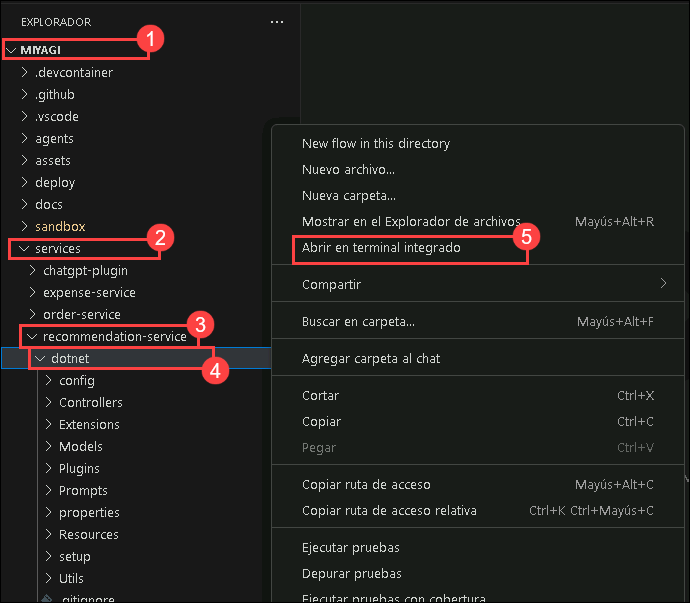

# Lab 3: Expose OpenAI through API Management Service

In this lab, you'll be verifying and creating APIs in the deployed API Management service to update the Docker image for the recommendation service. The revision of the recommendation service from the Container App encapsulates the meticulous approach to maintaining and optimizing containerized applications within the project's scope.
 
   > **Note**: Please note that authentication is not configured for APIM. In production, you will be configuring authentication in addition to other best practices.

### Task 1: Verify the API Management Service and create an API with Operations

1. Navigate to the Azure portal, open the resource group named **miyagi-rg-<inject key="DeploymentID" enableCopy="false"/>**,  and select **miyagi-apim-<inject key="DeploymentID" enableCopy="false"/>** API Management service from the resources list.

   

1. In the **miyagi-apim-<inject key="DeploymentID" enableCopy="false"/>** API Management service, click on **APIs** **(1)** under APIs from the left menu and select **HTTP** **(2)** under Define a new API to create an HTTP API.

   

1. Enter the following values in the Create an HTTP API pane:
   
   | **Parameter**        | **Values**           | 
   | -------------------- | -------------------- | 
   | API Type **(1)**     | **Full**            | 
   | Display name **(2)** | **miyagi-api**       |
   | Web service URL **(3)** | **<inject key="OpenAIEndpoint" enableCopy="true"/>**   |
   | Products **(4)** | **Unlimited** |
   | Click on  **(5)** | **Create** |

   

1. Once the **HTTP API pane** is created, select **miyagi-api** **(1)** API from the list, select **Settings** **(2)**, scroll down to the Subscription part **Uncheck** **(3)** the Subscription required, and click on **Save** **(4)**.

   

1. In the **miyagi-api**, select **Design** **(1)**, and click on **+  Add operation** **(2)**. Fill in the following details in **Frontend** and click on **Save** **(6)**.

   | **Parameter**           | **Values**                                            | 
   | ------------------------| ------------------------------------------------------| 
   | Display name **(3)**    | **completions**                                       | 
   | URL **(4)**             | from the drop-down select **Post**                    |
   | URL **(5)**             | in text box enter **/openai/deployments/<inject key="CompletionModel" enableCopy="false"/>/chat/completions**  |

   

1. Once the **completions** operation is created successfully, click on **+  Add operation** **(1)**. Fill in the following details in **Frontend** and click on **Save** **(5)**.

   | **Parameter**           | **Values**                                            | 
   | ------------------------| ------------------------------------------------------| 
   | Display name **(2)**    | **embeddings**                                       | 
   | URL **(3)**             | from the drop-down select **Post**                    |
   | URL **(4)**             | in text box enter **/openai/deployments/<inject key="EmbeddingModel" enableCopy="false"/>/embeddings**  |

   

1. Once the **embeddings** operation is created successfully, click on the **Overview** page and copy the **Gateway URL**. Paste the Gateway URL into a notepad; you will need this for upcoming tasks.

   
   
### Task 2: Update the recommendation service configuration to access Azure Open AI through APIM

1. Navigate to Visual Studio Code and open the `appsettings.json` file from the path `C:\LabFiles\miyagi\services\recommendation-service\dotnet\appsettings.json`.

   

1. In the `appsettings.json` file, you have to replace the **endpoint** value from the **OpenAI resource endpoint** with the **API Gateway URL**, which you copied in Task-1 Step-7, and press Ctrl + S to save the file.

   

1. Open a new terminal by navigating to **miyagi/services/recommendation-service/dotnet** and right-clicking on the cascading menu and selecting **Open in intergate Terminal**.

    

1. Run the following command to run the recommendation service locally:

    ```
    dotnet build
    dotnet run
    ```

   **Note**: Let the command run; in the meantime, you can proceed with the next step.

1. Open another tab in Edge, and in the browser window, paste the following link:

   ```
   http://localhost:5224/swagger/index.html 
   ```

   **Note**: Refresh the page continuously until you get the swagger page for the recommendation service as depicted in the image below.

   

### Task 3: Verify that the recommendation service accesses Azure Open AI through APIM

1. Navigate to the **Miyagi** **(1)** folder, open the **ui/typescript** **(2)** folder, and then open the `.env` file. Replace the existing code for **RECCOMMENDATION_SERVICE_URL** with the below-provided URL, and then save the file.

   ```
   http://localhost:5224
   ```

   

1. Open a new terminal by navigating to **Miyagi** and right-clicking on **ui/typescript**. In the cascading menu, select **Open in intergate Terminal**.

   

1. Run the following command to install the dependencies:
   
    ```
    npm install --global yarn
    yarn install
    yarn dev
    ```

   **Note**: Let the command run; in the meantime, you can proceed with the next step.

1. Open another tab in Edge and browse the following:

   ```
   http://localhost:4001
   ```

   **Note**: Refresh the page continuously until you get the Miyagi app running locally, as depicted in the image below.
                       
   

1. On the **personalize** page, select your **financial advisor** from the drop-down menu and click on **Personalize**.

     

1. You should see the recommendations from the recommendation service in the Top Stocks widget.

    

1. Navigate to **Visual Studio Code** and click on **dotnet**. From the Terminal, you can go through the logs.

   

1. From the Terminal, select Node terminal and press Ctrl + C to stop the recommendation service UI page. Now, click on Next from the lower right corner to move to the next page.
